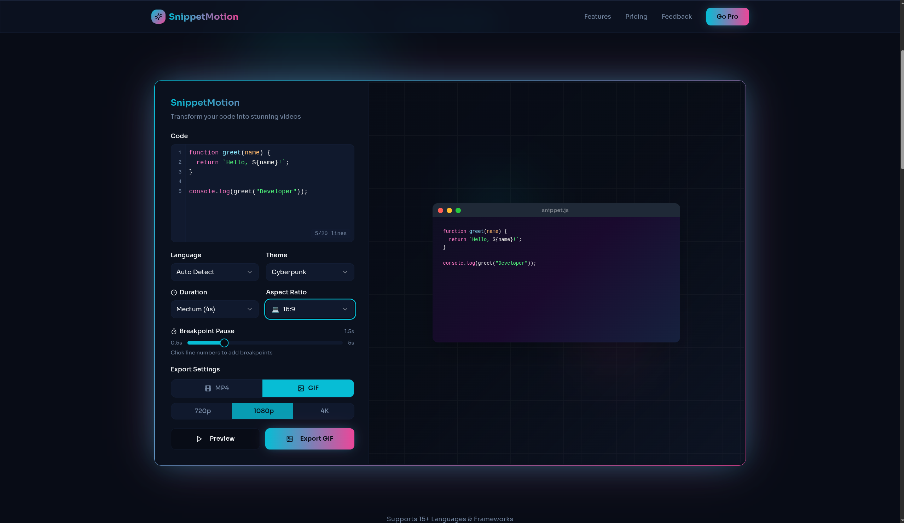

# [SnippetMotion](https://snippetmotion.vercel.app)

[]()
[](https://reactjs.org/)
[](https://www.typescriptlang.org/)


Inspired from carbon, Create beautiful, shareable animated code videos or gifs in seconds. Perfect for social media, GitHub READMEs, tutorials, and more.

---
<div align="center">
  
  <p align="center"><em>Desktop Demo</em></p>

  <table align="center">
    <tr>
      <td width="70%" align="center">
        
        <p align="center"><em>Interface</em></p>
      </td>
      <td width="30%" align="center">
        
        <p align="center"><em>Mobile Demo</em></p>
      </td>
    </tr>
  </table>
</div>

checkout the online hosted version: snippetmotion.vercel.app

## Features

- **Fast Export** - Optimized pipeline exports videos 2-3x faster
- **Multiple Formats** - Portrait (9:16), Square (1:1), Landscape (16:9)
- **Beautiful Themes** - 6 stunning color themes
- **Smart Highlighting** - Auto-detection for 20+ programming languages
- **Breakpoints** - Add pauses at specific lines for emphasis
- **Export Options** - MP4 video and GIF formats
- **High Quality** - 720p, 1080p, and 4K resolution support
- **Real-time Preview** - See your animation before exporting
- **No Login** - Start creating immediately

## Quick Start

### Prerequisites

- [Bun](https://bun.sh/) (latest version)

### Installation


```bash
# Clone the repository
git clone <GIT_URL>
cd snippetmotion-main

# Install dependencies
bun install

# Start development server
bun run dev
```

Visit `http://localhost:8080` to start creating.

### Build

```bash
# Build for production
bun run build

# Preview production build
bun run preview
```


## Use Cases

SnippetMotion is perfect for showcasing code in an engaging, visual way:

- **Social Media** - Create eye-catching code snippets for TikTok, Instagram Reels, YouTube Shorts, Twitter, and LinkedIn
- **GitHub READMEs** - Add animated GIFs to showcase projects, APIs, and tutorials
- **Educational Content** - Enhance YouTube tutorials, online courses, blog posts, and workshops with animated code examples
- **Portfolios & Presentations** - Showcase coding skills in developer portfolios, job applications, and conference talks
- **Marketing** - Create engaging product demos, feature announcements, and technical content for developer communities


## Customization

### Adding Themes

Edit `src/components/CodePreview.tsx`:

```typescript
const themeGradients: Record<string, { bg: string; card: string }> = {
  yourTheme: {
    bg: "linear-gradient(...)",
    card: "linear-gradient(...)",
  },
};
```

### Export Settings

Modify `src/hooks/useVideoExport.ts` to adjust FPS, scale, and bitrate.

## Contributing

Contributions are welcome! Please feel free to submit a Pull Request.

## License

This project is licensed under the GNU Affero General Public License v3.0 (AGPL-3.0). See the [LICENSE](LICENSE) file for details.

## Acknowledgments

- [shadcn/ui](https://ui.shadcn.com/) - Beautiful components
- [Highlight.js](https://highlightjs.org/) - Syntax highlighting
- [html2canvas](https://html2canvas.hertzen.com/) - Canvas capture
- [gif.js](https://jnordberg.github.io/gif.js/) - GIF generation

---

